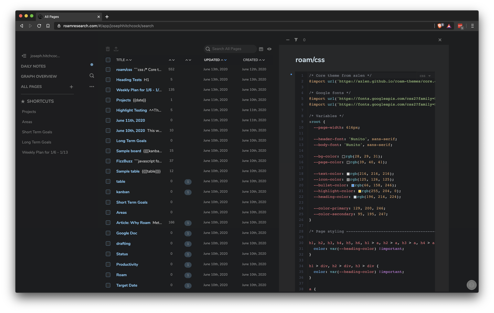
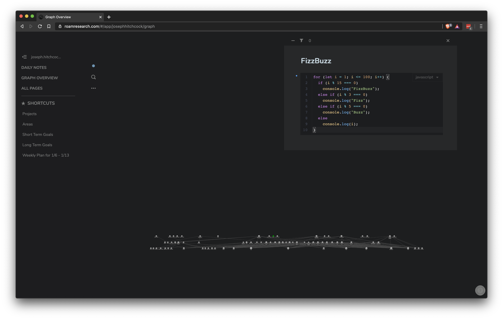

# Grizzly

This theme is styled off of Atom's **One Dark** syntax highlighting and the notes design from **Bear**.

It builds off of a core theme created by [azlen](https://github.com/azlen/roam-themes), which does most of the heavy lifting.

## Usage
1. Create a note named **`roam/css`**.
2. Paste in the contents of [`grizzly.css`](https://raw.githubusercontent.com/josephhitchcock/roam-themes/master/grizzly.css)

## Screenshots

